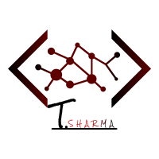

<!-- Notepad Vault -->

<!-- PROJECT LOGO -->
 

  

  <h3 align="center">Notepad Web API with Token Authentication</h3>

Here's a blank template to get started:
**To avoid retyping too much info. Do a search and replace with your text editor for the following:**
`trrakee`, `notepadWebAPI`, ``, `tas2124@gmail.com`, `Notepad Web API with Token Authentication`, `project_description`

### Built With

* [C# .NET]()
* [Angular 7]()

<!-- GETTING STARTED -->
## Getting Started

* Run and build the solution in visual studios. The solution is in the **WebAPI** folder.
* Then in the **Angular 7** folder, open a command prompt and run **ng serve** to run the angular application assuming you have angular CLI installed on your local machine.
* If you do not, go to this link, https://cli.angular.io/.

* Once both the solution and angular application are running, please register a user of your choice. 
* Enter a Username and a Password.

* You will then be able to login to the application.

<!-- CONTACT -->
## Contact

Tushar Sharma or Troy - tas2124@gmail.com

Project Link: [https://github.com/trrakee/notepadWebAPI](https://github.com/trrakee/notepadWebAPI)
